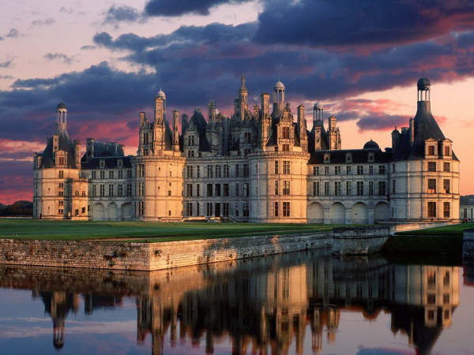

# Ma region

### Informations sur **la Région Centre-Val de Loire**

#### **Population :**
- **2,56 millions d’habitants** selon les données de l'INSEE (2021).

#### **Départements :**
- Cher, Eure-et-Loir, Indre, Indre-et-Loire, Loir-et-Cher, Loiret.

#### **Lieux à visiter :**
1. **Château de Chambord** :
   - Symbole de la Renaissance française.
   - Célèbre pour son architecture unique et son escalier à double révolution.
2. **Château de Chenonceau** :
   - Surnommé le "Château des Dames".
   - Remarquable par sa galerie qui enjambe le Cher.
3. **Cathédrale de Chartres** :
   - Inscrite au patrimoine mondial de l'UNESCO.
   - Renommée pour ses vitraux et son architecture gothique.
4. **Maison de George Sand à Nohant** :
   - Demeure de l’écrivaine George Sand, qui offre un aperçu de sa vie et de son œuvre.
5. **Parc naturel régional de la Brenne** :
   - Surnommé le "pays des mille étangs".
   - Idéal pour les amoureux de la nature et de l'ornithologie.

#### **Personnalités liées :**
1. **Jeanne d'Arc** :
   - Originaire de Domrémy, elle a marqué l’histoire de la région, notamment à Orléans où elle a libéré la ville en 1429.
2. **François Rabelais** :
   - Écrivain humaniste de la Renaissance, né près de Chinon.
3. **Honoré de Balzac** :
   - Romancier majeur du XIXᵉ siècle, il a passé une partie de sa jeunesse à Tours.
4. **George Sand** :
   - Auteure prolifique du XIXᵉ siècle, elle a vécu à Nohant dans l'Indre.
5. **Jacques Cœur** :
   - Grand argentier du roi Charles VII, il a fait construire le palais Jacques-Cœur à Bourges.

[Index](index.md)

[Ma-Ville](ma-ville.md)

[Mon-departement](mon-departement.md)

[Ma-region](ma-region.md)