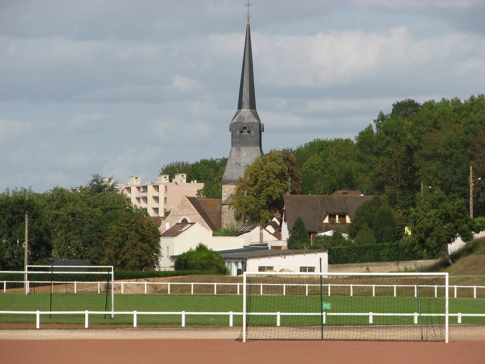

# Ville

### Informations sur **Vernouillet (28)**

#### **Population :**
- **12 455 habitants** selon les données de l'INSEE (2021).

#### **Lieux à visiter :**
1. **Prieuré Saint-Thibault** :
   - Construit au XIIᵉ siècle par Robert Iᵉʳ, comte de Dreux.
   - Aujourd'hui, il ne subsiste que les caves aux magnifiques arcs doubleaux.
2. **Église de Vernouillet** :
   - Un édifice historique qui reflète le patrimoine religieux de la région.
3. **Parc du Château de Vernouillet** :
   - Un espace vert agréable pour des promenades et des activités en plein air.

#### **Personnalités liées à la ville :**
- Aucune personnalité célèbre directement associée à Vernouillet n’est particulièrement notée, mais la ville dispose d’un patrimoine historique et culturel intéressant.

[Index](index.md)

[Ma-Ville](ma-ville.md)

[Mon-departement](mon-departement.md)

[Ma-region](ma-region.md)