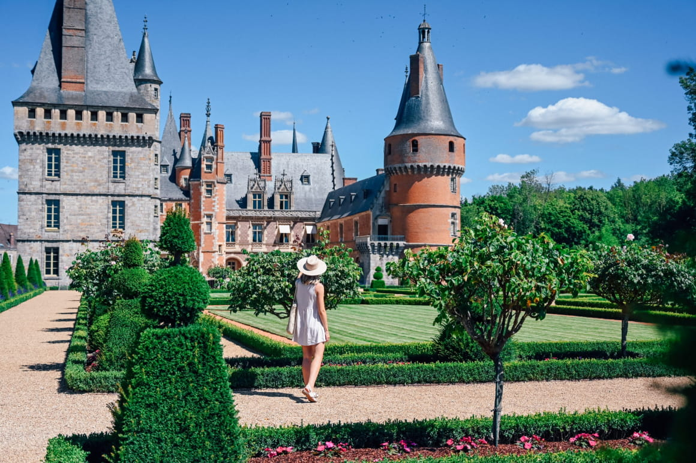

# Departement

### Informations sur **Eure-et-Loir**

#### **Population :**
- **431 575 habitants** selon les données de l'INSEE (2019).

#### **Lieux à visiter :**
1. **Cathédrale de Chartres** :
   - Inscrite au patrimoine mondial de l'UNESCO.
   - Célèbre pour ses vitraux et son architecture gothique.
2. **Château de Châteaudun** :
   - Ancienne résidence de Jean de Dunois, compagnon d'armes de Jeanne d'Arc.
   - Mélange d'architecture médiévale et Renaissance.
3. **Parc naturel régional du Perche** :
   - Paysages vallonnés et forêts denses.
   - Idéal pour les amateurs de nature et de randonnées.
4. **Bonneval** :
   - Surnommée la "Petite Venise de la Beauce", traversée par le Loir.
5. **Château de Maintenon** :
   - Résidence de Madame de Maintenon, épouse secrète de Louis XIV.
   - Entouré de magnifiques jardins et d'un aqueduc inachevé.

#### **Personnalités liées :**
1. **Marcel Proust** :
   - Inspiré par Illiers, aujourd'hui renommée Illiers-Combray, pour son œuvre *À la recherche du temps perdu*.
2. **Maximilien de Béthune, duc de Sully** :
   - Ministre d'Henri IV, décédé au château de Villebon.
3. **Chaïm Soutine** :
   - Peintre d'origine russe ayant résidé à Lèves, près de Chartres.

[Index](index.md)

[Ma-Ville](ma-ville.md)

[Mon-departement](mon-departement.md)

[Ma-region](ma-region.md)