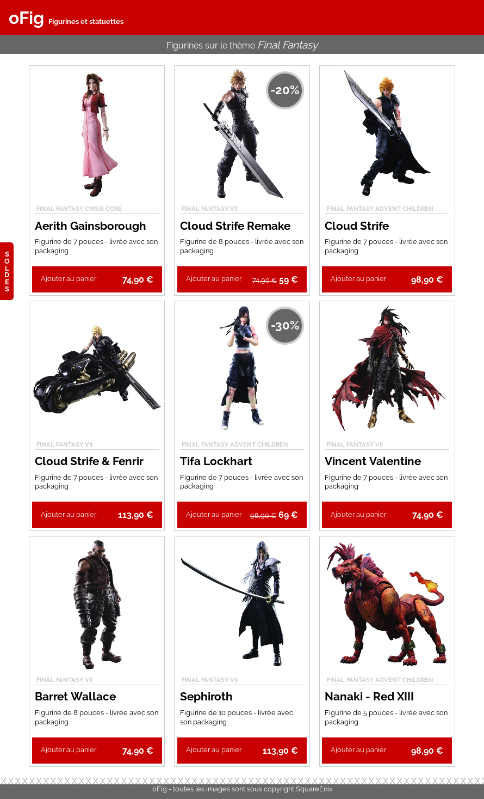

# oFig

Boutique de figurines

## Objectif

Votre objectif est de réaliser cette intégration en utilisant flexbox, des balises sémantiques et des class CSS

Les images se trouvent dans le dossier `images/` du projet

Les textes sont dans le dossier des ressources : `ressources/textes.txt`

## Charte

Font : Raleway (trouvable sur Google fonts)

Couleurs :

- Rouge : `#c80000`
- Gris foncé : `#666`
- Gris clair (bordures et catégorie): `#ccc`
- du noir pour les textes et fond blanc

---

  Bonus <strong>facultatif</strong>

## En complément

Vous pouvez envisager de compléter l'intégration avec tous les contenus proposés

---

  Super bonus <strong>toujours facultatif</strong>

## Bonus exploratoire

Toujours pas rassasié ? Essayez donc d'intégrer ces nouveaux éléments 😉

